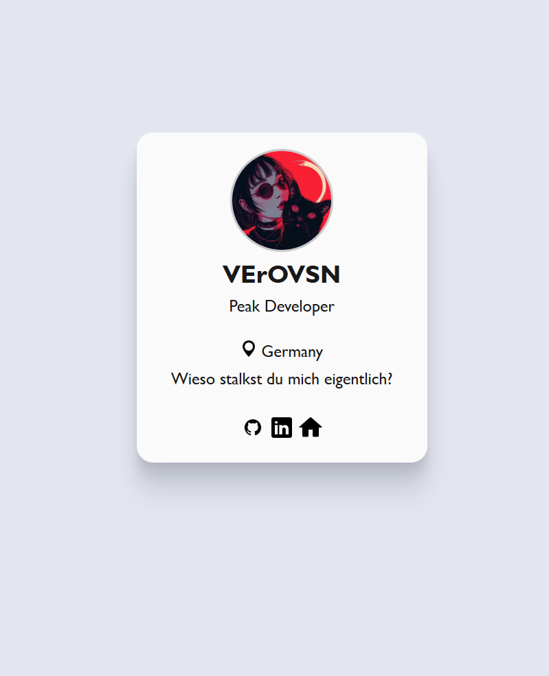

# 💼 Business XCard – by VErOVSN

**Business XCard** ist eine minimalistische, moderne digitale Visitenkarte, entwickelt von **VErOVSN**.  
Sie wurde gebaut, um schnell, clean und leicht anpassbar zu sein – perfekt als kleine persönliche Webkarte oder Portfolio-Link.

---

## 🚀 Vorschau



---

## ✨ Features

- 🎨 Modernes, schlichtes Design  
- ⚡ 100 % HTML & CSS – kein Framework nötig  
- 📱 Responsive & leicht  
- 💬 Einfach anpassbar (Name, Farben, Icons, Text)  
- 🌑 Dark Design für angenehme Darstellung  

---

## 🛠️ Verwendung

1. **Repository klonen**
   ```bash
   git clone https://github.com/verovsn/Business-XCard.git
Datei öffnen
Öffne einfach index.html im Browser – fertig ✅

Anpassen

Ändere Name, Text & Icons in index.html

Passe Farben & Hintergründe in style.css an

🎨 Beispiel: Hintergrundfarbe ändern

 ``body {
    background: linear-gradient(160deg, #1e1e2e, #0f172a);
} ``

👤 Über den Entwickler
VErOVSN

Peak Developer • Creator • Visionär

🌍 Germany
💻 github.com/verovsn
https://verovision.eu/

💬 „Wieso stalkst du mich eigentlich?“ 😎

## 📜 Lizenz
Dieses Projekt steht unter der MIT License.
Du darfst es frei verwenden, verändern und teilen — bitte gib Credits an VErOVSN an, wenn du es nutzt.

🧠 „Simplicity ist die höchste Form von Eleganz.“ – VErOVSN
